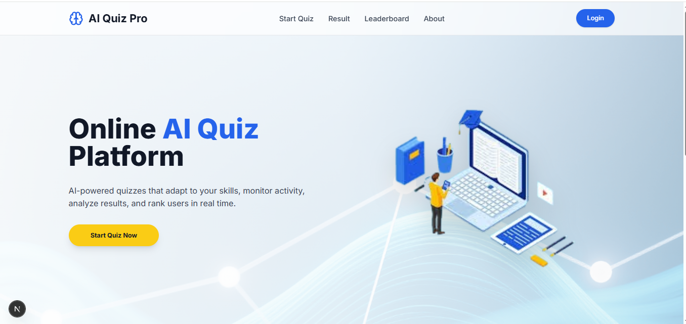
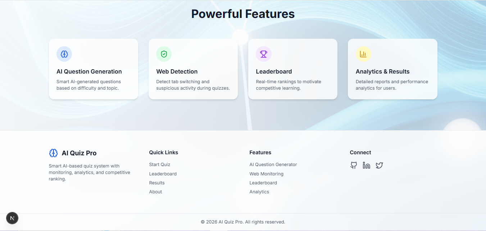
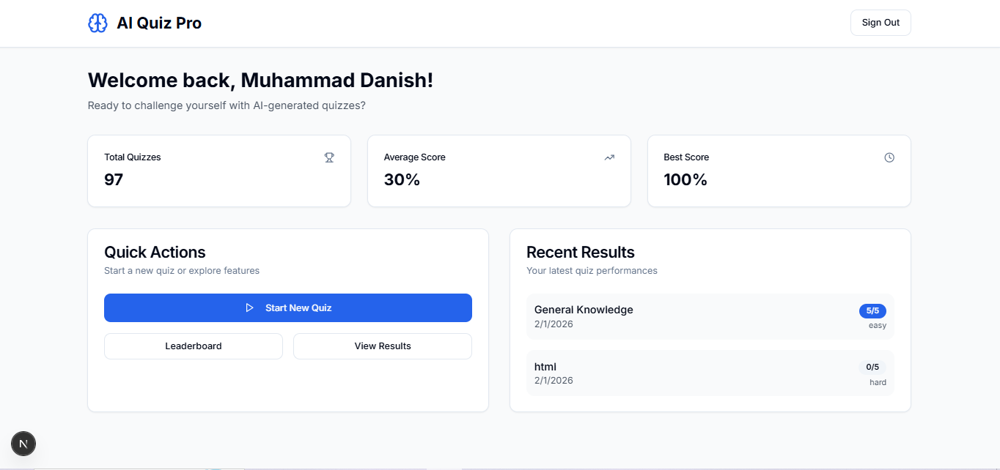
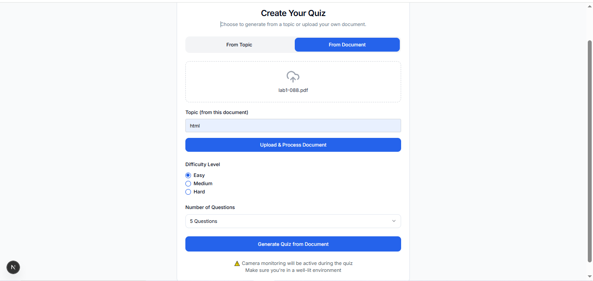
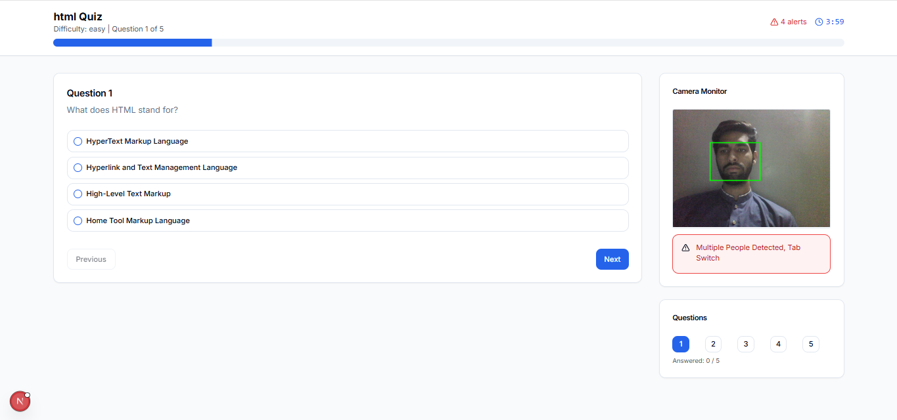
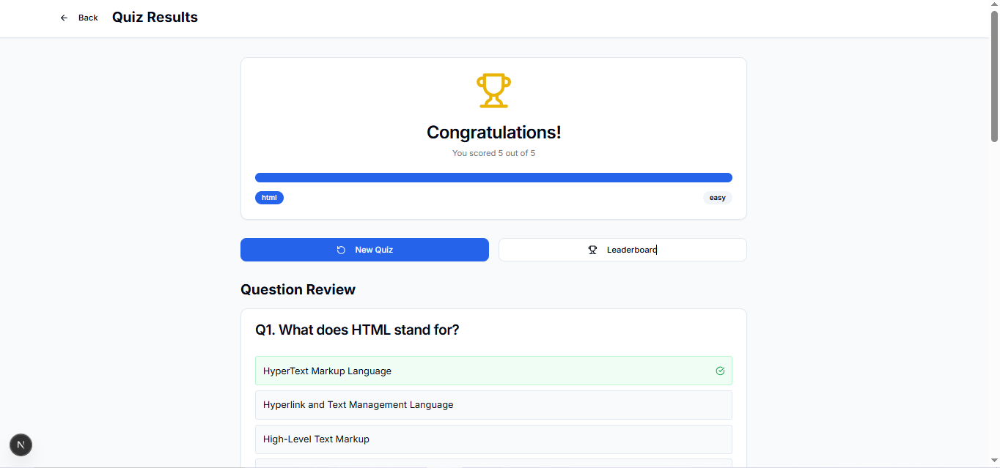
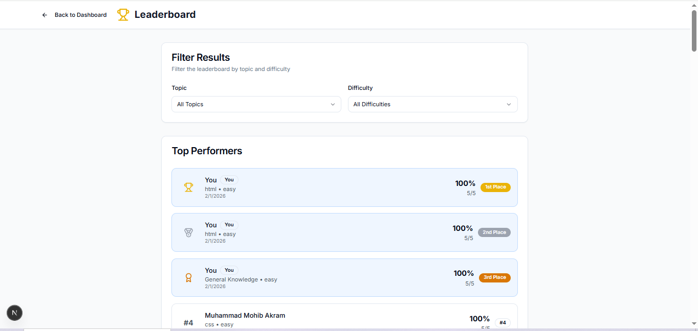

# AI Quiz Application

A comprehensive AI-powered quiz application with real-time monitoring, RAG-based document processing, and intelligent quiz generation.

## 📸 Application Preview

### Landing Page


### Landing Page 2


### Dashboard


### Quiz Starting Page


### Quiz Interface


### Quiz Results


### Leaderboard


## 🚀 Features

### Core Functionality
- **AI-Powered Quiz Generation**: Generate quizzes from uploaded PDF documents using Google Gemini AI
- **RAG (Retrieval-Augmented Generation)**: Advanced document processing with vector similarity search
- **Real-time Proctoring**: Webcam-based monitoring with face detection and violation tracking
- **Multi-User Support**: Complete authentication system with role-based access
- **Leaderboard System**: Competitive scoring with filtering by topic and difficulty
- **Responsive Design**: Mobile-first design with Tailwind CSS

## 🏗️ Project Structure

```
ai-quiz-app-final/
├── app/                         
│   ├── admin/                     # Admin dashboard
│   ├── api/                       # API routes
│   ├── dashboard/                  # User dashboard
│   ├── leaderboard/                # Leaderboard with filters
│   ├── login/                     # Authentication
│   ├── quiz/                      # Quiz interface 
│   ├── result/                    # Results display 
│   ├── signup/                    # User registration
│   ├── globals.css                # Global styles
│   ├── layout.tsx                # Root layout
│   └── page.tsx                 # Landing page
├── backend/                      # FastAPI Python backend
│   ├── api.py                    # API endpoints
│   ├── main.py                   # FastAPI application
│   ├── rag.py                    # RAG system implementation
│   ├── security.py               # Authentication middleware
│   └── requirements.txt          # Python dependencies
├── components/                   # Reusable React components
│   ├── ui/                      # UI component library   │   
│   └── webcam-monitor.tsx         # Proctoring component 
├── public/                      # Static assets
├── .env                         # Environment variables
├── package.json                 # Node.js dependencies
├── run.py                      # Backend startup script
└── tailwind.config.ts           # Tailwind configuration
```

## 🛠️ Technology Stack

### Frontend
- **Framework**: Next.js 15.2.4 with App Router
- **Styling**: Tailwind CSS with Radix UI components
- **Authentication**: Firebase Auth
- **Database**: Firestore
- **AI Integration**: Google Generative AI (Gemini)
- **Computer Vision**: TensorFlow.js with BlazeFace model

### Backend
- **Framework**: FastAPI (Python)
- **AI**: LangChain with Google Gemini
- **Document Processing**: PyPDF, Sentence Transformers
- **Vector Database**: FAISS
- **Embeddings**: HuggingFace Sentence Transformers

### Infrastructure
- **Database**: Firebase Firestore
- **Authentication**: Firebase Authentication
- **File Storage**: Temporary file processing
- **Real-time**: Firebase real-time listeners

## 🔧 Installation & Setup

### Prerequisites
- Node.js 18+ and npm/yarn
- Python 3.8+ and pip
- Google API Key for Gemini
- Firebase project configuration

### Frontend Setup
```bash
# Install dependencies
npm install

# Configure environment variables
cp .env.example .env
# Add your Firebase and Google API keys

# Run development server
npm run dev
```

### Backend Setup
```bash
# Navigate to backend directory
cd backend

# Create virtual environment
python -m venv venv
source venv/bin/activate  # On Windows: venv\Scripts\activate

# Install dependencies
pip install -r requirements.txt

# Run backend server
python run.py
```

### Environment Variables
```env
# Frontend (.env)
NEXT_PUBLIC_FIREBASE_API_KEY=your_firebase_api_key
NEXT_PUBLIC_FIREBASE_AUTH_DOMAIN=your_project.firebaseapp.com
NEXT_PUBLIC_FIREBASE_PROJECT_ID=your_project_id
NEXT_PUBLIC_FIREBASE_STORAGE_BUCKET=your_project.appspot.com
NEXT_PUBLIC_FIREBASE_MESSAGING_SENDER_ID=your_sender_id
NEXT_PUBLIC_FIREBASE_APP_ID=your_app_id

# Backend (.env)
GOOGLE_API_KEY=your_google_gemini_api_key
BACKEND_API_KEY=your_backend_api_key
```

## 📱 Core Features Explained

### 1. AI Quiz Generation
- Upload PDF documents for processing
- Automatic text extraction and chunking
- Vector embedding generation for semantic search
- Context-aware quiz generation with customizable parameters

### 2. Real-time Proctoring
- Webcam-based face detection using TensorFlow.js
- Multi-person detection alerts
- Tab switching and fullscreen exit monitoring
- Configurable violation thresholds (default: 3 violations)
- Automatic camera shutdown on threshold breach


### 3. Quiz Interface
- Responsive question display with radio buttons
- Real-time progress tracking
- Question navigation with numbered buttons
- Timer functionality with visual indicators
- Violation tracking with visual alerts

### 4. Results & Analytics
- Detailed quiz results with explanations
- Performance metrics and scoring
- Historical results tracking
- Leaderboard with filtering (topic, difficulty)
- Comparative analysis with averages

## 👥 Team Members

- **Muhammad Danish**   
- **Mohib Akram** 
- **Taha Haider** 


## ⭐ Final Note

This **AI Quiz Application** demonstrates the practical integration of **AI, real-time monitoring, modern web technologies, and backend intelligence** in a single full-stack system.

It is well-suited for:
- Semester and final-year projects  
- Research and academic demonstrations  
- Real-world AI-based assessment platforms  

If you find this project helpful, consider giving it a and sharing your feedback!
